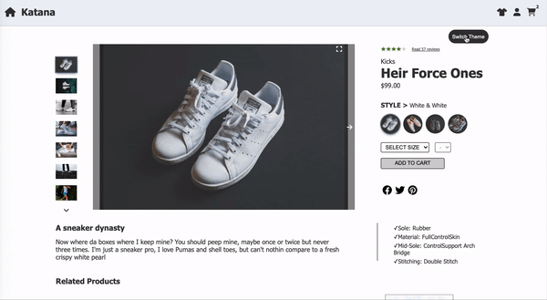
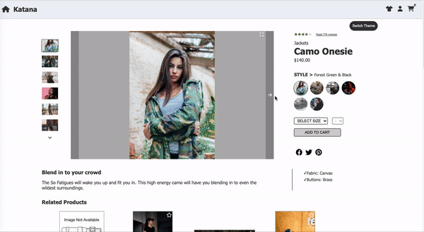
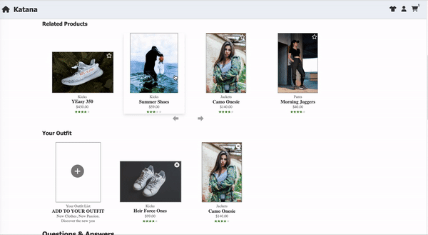
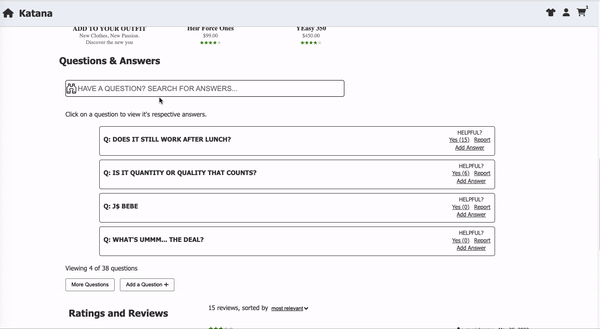
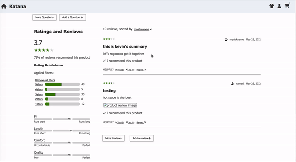

# Katana - Retail Web Portal

## Overview
Web and mobile-friendly front-end project that takes information from an API and displays it in an e-commerce format. The application is composed of 4 main components: product detail, related items and comparison, questions and answers, ratings and reviews.



## Table of Contents
- [Description](#description)
- [Installation](#installation-and-setup)
- [Technologies](#technologies)
- [Components](#components)
- [Team Members](#contributors)

## Description
This project was built by a team of 4 developers over a span of 2 weeks. We adhered to a 26 page business requirement document that highlighted client requests. Main technology used includes React (hooks) and styled components on the frontend, Express to gather API data, and AWS for deployment.

---

## Installation and Setup
1. Fork and clone the repo and navigate to the root directory.

2. To install dependencies:
```
npm install
```

3. To run webpack build:
```
npm run client-dev
```

4. To start the server (in a separate terminal):
```
npm run server-dev
```
5. Open http://localhost:3000 in your browser

---

## Technologies
- [React](https://reactjs.org/)
- [Node.js](nodejs.org)
- [Express](http://expressjs.com/)
- [Styled Components](https://styled-components.com/docs/)

---

## Components
### Product Detail
>This component displays the product details to the user through visuals and text. It allows the user to select specific sizes, styles, and quantities, along with the ability to check out a purchase.


### Related Items and Comparison
>This section displays products that are related to the current product, along with a list of products, that can be custom curated by the user to define an "outfit". 


### Questions and Answers
>This is where the user is able to view questions and answers about the product and also ask or answer questions themselves. It includes further interaction with the site, such as a searching functionality. 


### Ratings and Reviews
>This section displays a summary of ratings and a list of reviews for the product left by other customers. It includes filtering and sorting functionality, photo thumbnails and popups, interaction with reviews, and the ability to add a new review to the database. 


---

### Contributors
- [Aaron Bowers](https://github.com/aaron-bowers)
- [Isaac Chung](https://github.com/imizik)
- [Jessica Zhou](https://github.com/jessicazhou86)
- [Johnny Wu](https://github.com/Skydodle)
